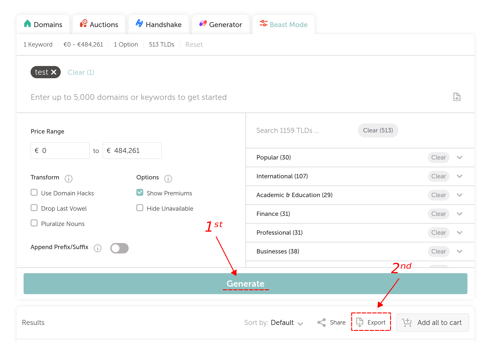
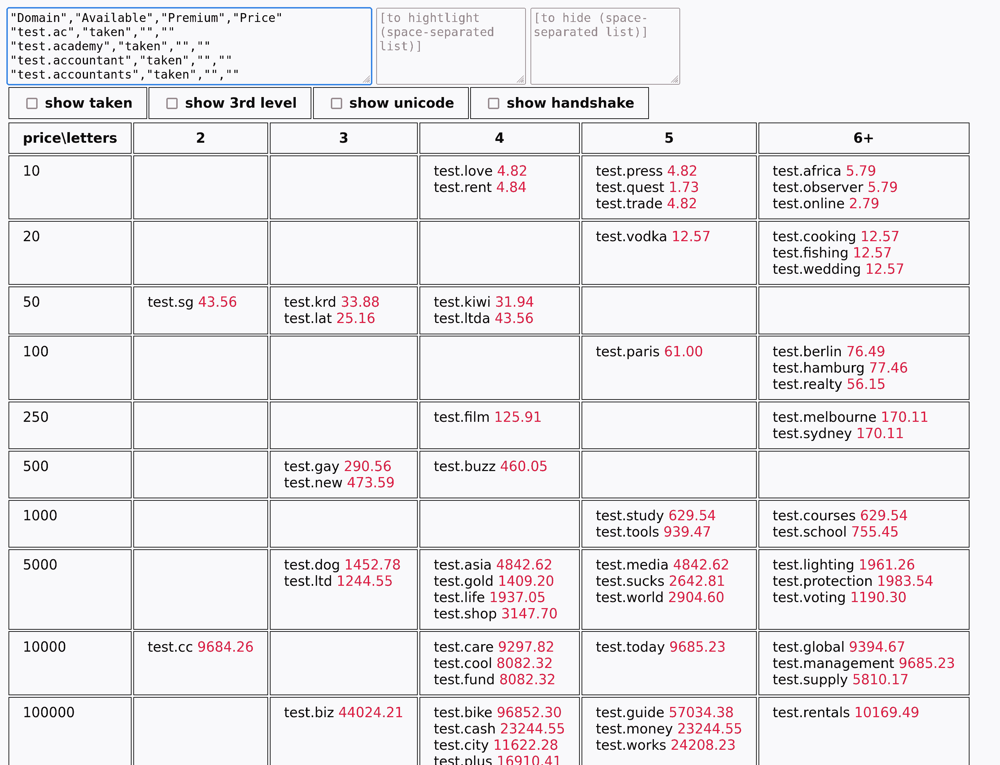

# tld

> sort .TLD's by length and price

(copy-paste @Namecheap's domain-search .CSV-export contents here)

## how-to

1. [pick domain name(s)](https://www.namecheap.com/domains/registration/results/?type=&domain=test)
2. switch to «Beast Mode», press «Generate», then «Export»

3. wait until [`results.csv`](results.csv) is downloaded
4. copy-paste its contents into the first text-area on the [gh-page](https://dym-sh.github.io/tld/)

## todo

- save state
- remember previous tlds
